Mic check mic check... Is this thing working...? Ahem!

# Hello!!!

Welcome to my blog! I'm glad to have you here, this is my first post here and today I wanted to talk about a game I've been playing a lot lately. After finishing Death Stranding 2 I've been hit with a sort of post-game depression (I will probably write about that one too), and while I was still gushing over Kojima's latest work I found a game I've tried in the past as a demo.

Before I talk the about it, I just wanna say how much I like the genre of hardcore, realistic extraction shooters. I've always wanted to try Escape From Tarkov. Ever since that game came out I've wanted to play it but I never got around it as there were many factors that made me shy away from it, there are a lot of cheaters, the game is not popular enough where I'm from (Is also prohibitively expensive here) so I'd always be going on foreign servers with high ping, I don't have anyone to play with and... the main one... being it's developer, Battlestate Games, who seem to ALWAYS be in some sort of controversy every week, not to mention that every Tarkov player I know describes Tarkov as an abusive relationship and I've had enough of that as a former Destiny 2 player. Destined to greatness, cursed to be managed by crazy people. Despite all of it's shortcomings that made me never pick up the game, Tarkov, with it's gameplay loop, realistic weapons, injury systems and all the good that comes with it, has still managed put this itch my back and this niche of gaming never had a title that came close to reaching that itch since the release of EFT, which was sorta always a distant dream. 

The game I'm about to tell you about is the cure of the itch I've had for years.

# Road to Vostok



The game is called **Road to Vostok**, and if Escape From Tarkov is Meth, this game is a well balanced meal in comparison. It's a singleplayer hardcore survival FPS that takes place in the border zone of Finalnd and Russia. Apparently, Finland, which was always has been a neutral country has been pushed over the edge and forced to take part in a conflict against or alongside russia, the details are very murky as there isn't a lot of lore to the game yet it's all rolling out very slowly but the fact is that something happened, something big, something that has plunged the area into disarray and made everyone leave and those who didn't fend for themselves.

In this game, just like in any good extraction shooter, you start from your shelter and make various pushes into the maps to get supplies and guns, then, get back to your shelter, relax, give yourself a pat on the back and go at it again. There are also quest items that you can deliver to NPCs to get access to new shelters. The game's story progression happens through days, as the days pass, different things happen that can change the enviroment and the gameplay dynamics I'll elaborate about all these in a bit...

...but first,

## Let's talk about the map!

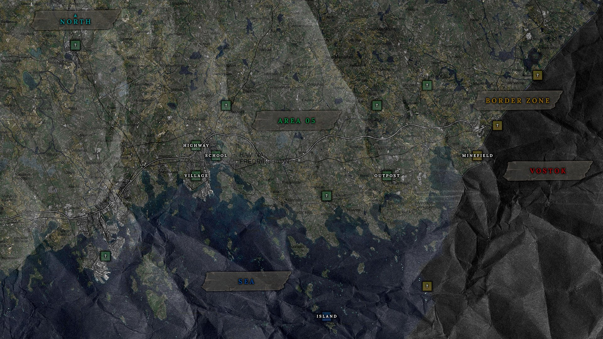

The map is divided into 3 sections, Area 05 which is Finland, Border Zone which is the transitory map between Finland and Russia and then, Vostok, in Russia.

First, we'll be taclking Area 05.

### Finland 🇫🇮



One of the countries.

Of all time.

* Highest consumption of milk in the world
* …as well as the highest consumption of coffee
* 0.07% of population
* 11% of all saunas
* epäjärjestelmällistyttämättömyydellänsäkäänköhän
* Most heavy metal bands per capita

None of this has to do with Vostok by the way, it's just very cool facts about the country.

Anyway...

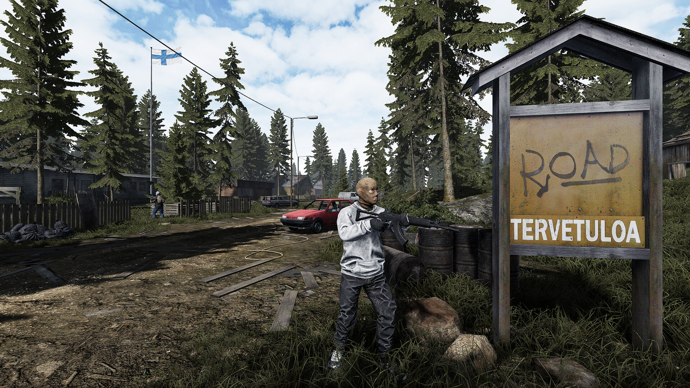 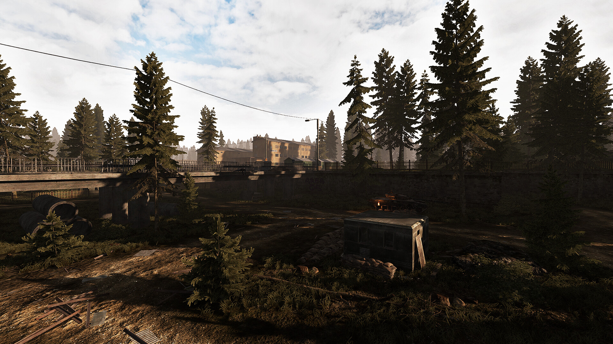

Area 05 is the starting area of the game, as the steam page of the game describes it, is an evacuated zone located in the southeastern part of Finland. In Area 05, you will find shelters, traders, tasks, and starting loot for initial survival. In this area, the first and main enemies are bandits from an anarchist group that takes advantage of the lack of authority in this area. 

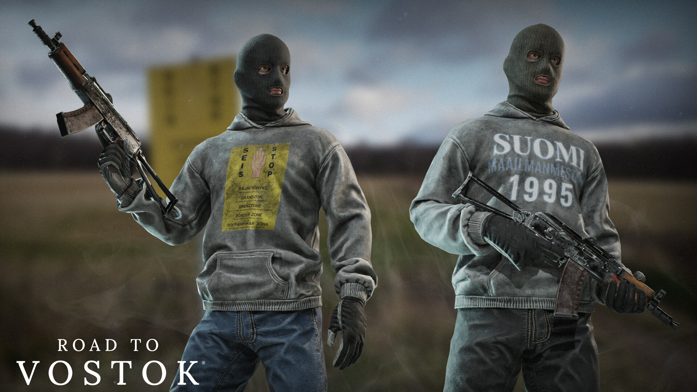 

The enemies in this game in general are it's biggest shortcoming according to several people who turned down the game at this time due to the AI being kinda goofy. Despite that, in my opinion, the gameplay is still very enticing as the AI *can* sometimes be good and catch you by surprise. It's VERY inconsistent and, honestly, this inconsistency is what makes it kind of good in my opinion.

Sometimes, you can spot the enemies aimlessly wandering the map looking like confused roombas that you can line up an easy shot and down them before they can turn around and return fire.

Sometimes they can compensate for their lack of tactical thinking and spot you from a mile away in a pitch black night to open fire at you.

Sometimes, when they spot you or you can't shoot them dead they can run away and reposition, this is largely ineffective as they just seem to turn into a faster roomba, they don't exactly run to good spots to return fire, they just... run. But sometimes, when they run, they can go into confined rooms like a bathroom of a kitchen where their pathfinding will break and be in a state where they will be just sitting still there in ABSOLUTE silence (they usually aren't quiet, they are quite talkative in fact, which only aggravates this) and this the single deadliest behaviour they can showcase. I've had runs where I lost bandits in exchanges just to find them while looting some place else entirely because they were broken in a bathroom corner and instantly shot me as I open the door like making some rooms feel like they're booby trapped. The bots have still a long way to go, but as they stand right now, they're okay-ish and are a reasonable enough threat to worry about in the game.

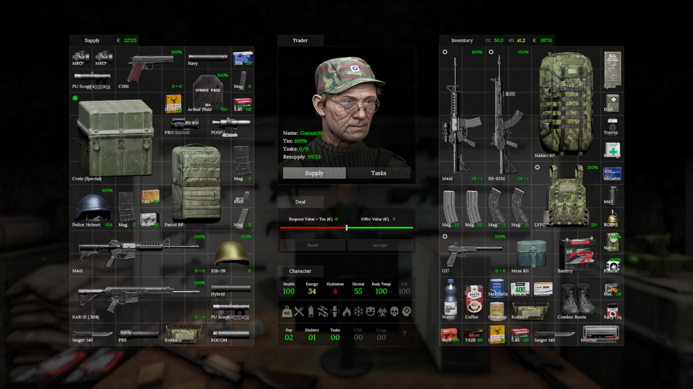

In Area 05, besides the enemies you also have a few NPCs which can sell you stuff and give you quests, each NPC has 10 quests which all are fetch quests that are basically deliveries, you get what they want, they give you something in return. 8 of 10 quests are for general items varying in rarity, the 9th quest is usually for a specific item for a rare reward and the 10th are for exceedinly rare and/or unique items that once turned in will give you a shelter key. Each shelter unlocked via an NPC quest will put you very near them, the Generalist will let you live on his attic, the Doctor will let you have a classroom in the school and the Gunsmith will give you a key to the bunker.

Speaking of shelters, they are one of the highlights of the came since they are fully customizable and every single item can be placed however you want it

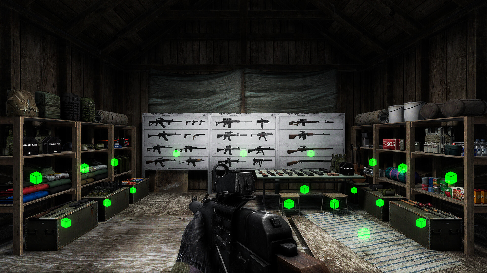

I think this is the part of the game where i've spent the most time, tidying up my shelter and moving furniture around really makes them feel like my own which is amazing. 

### Border Zone ⚠️

Next on the map is the Border Zone, which is the Border between Finland and Russia, currently there is only one Border map and each border map is supposed to have it's own obstacles to traverse to the other side. Upcoming border maps will have waterways where you have to cross with a boat, physical obstacles but the one map we have right now is... a minefield. 

The minefield is the first real gut punch the game throws at you as this is a real step up from Area 05, here we have another kind of enemy which are the guards

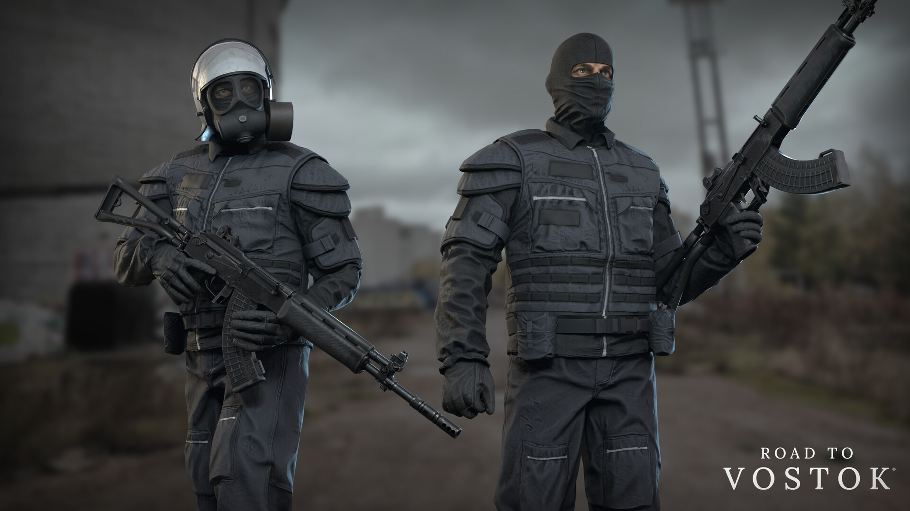

These guys are usually sitting on very high watch towers scattered at the second half of the map, here it's PARAMOUT that you stay low and try not to get spotted since getting into a fire fight here could spell doom for you since if you get seen it's pretty hard to hit these guys if they're on their towers and you're essentially pinned down at every second because relocating, repositioning is incredibly difficult and running is simply not an option, after all, we're in a minefield, any wrong step you take could set off one of the many mines and also alert the guards. The soundtrack here also takes a drastic turn, here in the minefield it's very eery and scary, traversing the minefields is no easy feat...

...especially at nighttime.



Now, if you don't think the game is terrifying enough as is, I have good news for you! Because the minefield is the only the first step in your journey, next we're gonna talk about the place where you get when you actually cross the minefield, Vostok.

### Russia 🇷🇺



This is where I absolutely fell in love with the game.

Once you managed to cross the Minefield, the first area you're greeted with are the apartments, a set of soviet era buildings filled with the best quality loot this game can offer. Now, before I talk about the apartments, it's important that I talk about what happens if you die in the game. Normally, if you die, all of your gear you had on you is lost with no way of picking it back up, you respawn at the last shelter you were in, and, hopefully, if you had backup guns stashed there you can go at it again. If you die in any of the Vostok areas, it's game over. You lose all of your gear, all of your progress, all of your quests, all of your shelters and **your save file gets deleted.** No sugar coating. Vostok is a permadeath zone.

Entering the apartments map you get greeted firstly by a red skull on the top right of your screen indicating that you just entered the permadeath zone. Here, your main enemy will be the russian military, armed with high end gear and plate carriers. Taking your first steps in Vostok and entering the first building had me absolutely terrified of getting shot, the soundtrack is really ominous and I don't think any other game has nailed the feeling that I'm in a place where I ABSOLUTELY SHOULD NOT BE as Road to Vostok did.



The eery soundtrack and ambiance sounds, the skull on the top right corner of the screen always staring at you create an unshakable feeling of paranoia.

A feeling that will get turned into pure dread the moment when you start getting shot at.



And this is where Road to Vostok really shines, it's bad enough to take on fights knowing where your enemy is but nothing feels worse in this game as NOT knowing where the enemy is anymore after loosing them in an exchange. This combined with all the ambiance that was built priorly makes this game ever more anxiety inducing as everything you can do now, is to scan the enviroment desperately looking for intel on where your enemy might have gone, the tension builds up tremendously as the fight take a turn from being physical to psychological because every single thing I just mentioned up until this point piles up and the tension is only temporarily relieved when you find them again and you manage to kill them. And you better have a good scope on your gun to do it because they'll very often shoot you from windows and rooftops from the buildings accross, these guys won't bumrush you like the Finnish bandits. 

Oh and by the way, these scopes you can only get here in Vostok, so good luck in your first run because the best scope you can get before getting to apartments is a 1x red dot. Running around without a good scope here makes you feel absolutely powerless as it's VERY difficult to spot enemies and even harder to return fire at a distance.

Here you can find a lot of great shit, like new rifles, new pistol, plate carriers, armor plates, grenades, a new knife lots of stuff, so it's incredibly rewarding despite the stratopherically high risk.

After looting everything you can get your hands on Apartments and Terminal (only if you're brave enough) It's time to head home, and if you manage not to die in Vostok, your second trip around the minefield awaits, you are (hopefully) much better equiped now but the fact that you can still loose all the shit you got in a jiffy still makes it very unnerving.

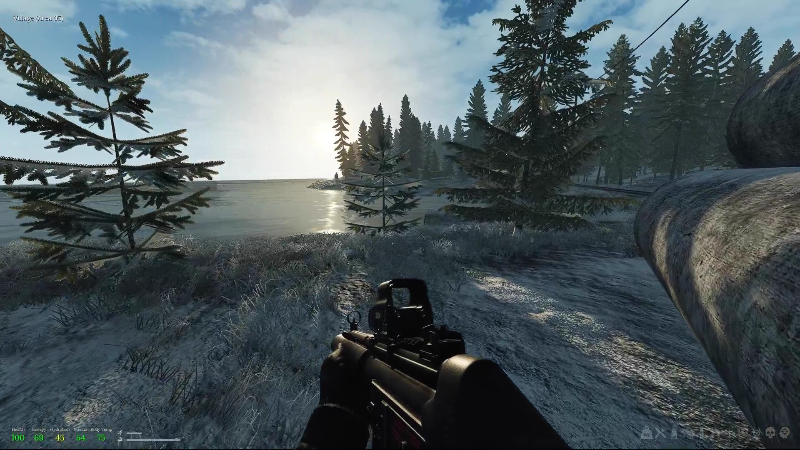

After you manage to get home and stash your newly found loot, give yourself a pat on the back, you made it, and now, you can rest and customize your shelter again until hitting the road again.

## Weapons

Now let's talk about my main point of appreciation of this game which is the weapons, there aren't too many weapons in the game yet but the few that are there offer decent variety already. Every single gun is exceptionally modeled to be incredibly faithful recreations of the real world firearms these guns are based on and on top of that, they sound incredibly good too. They are also filled with tiny little details all around such as the fire selector which is functional in every gun that you can change the fire mode on (Although not fully since you can put the guns on safe or burst fire on guns that should accept bursts but still very cool nonetheless)

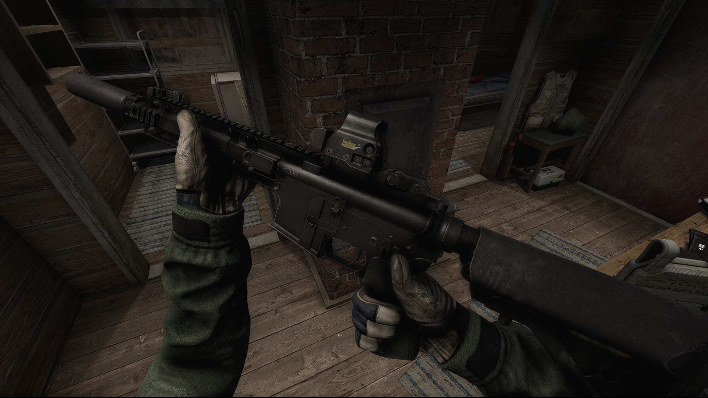 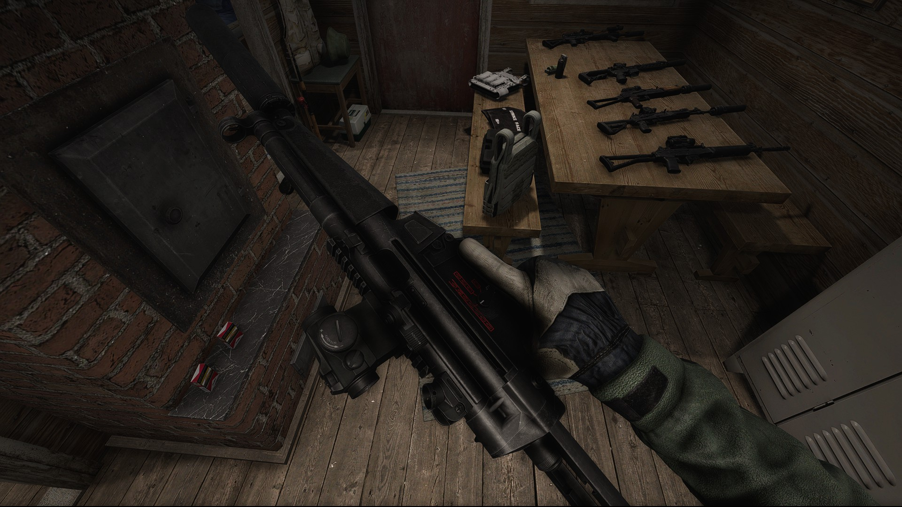 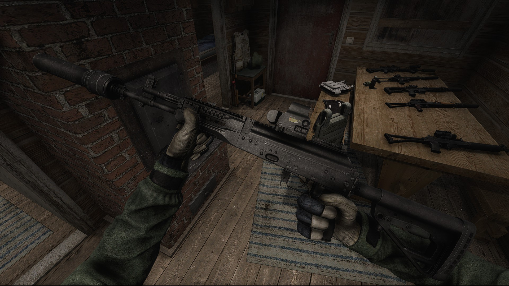

There are quite a few to chose from, I usually find it quite good to run an assault rifle paired with an SMG and recently, I've developed a new love for the Finnish service rifle that is quite common in Area 05 that is the RK-62 (Which by the way, is the very same rifle my favorite assault rifle of all time is based on, the IMI Galil!), however, my favorite gun in this game is no doubt the modernized version of the RK-62, the RK-62M which can be found in Vostok sometimes. It looks absolutely stunning, it's a very elegant rifle.

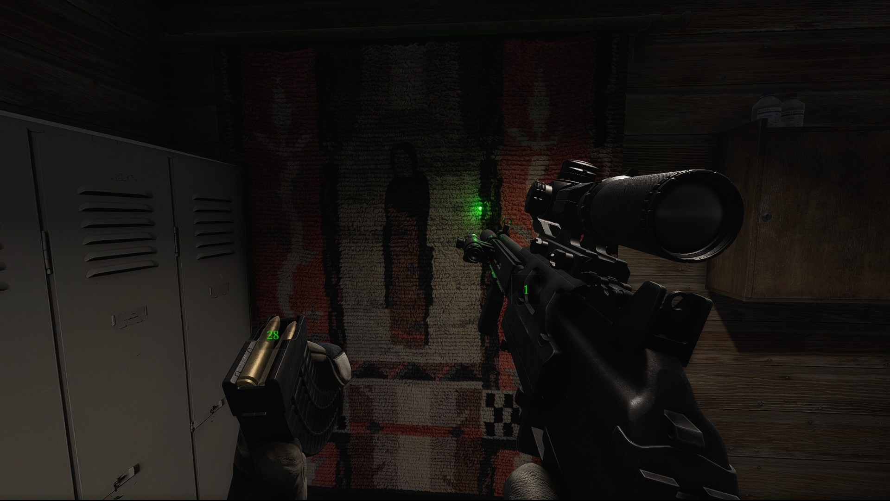 

You can check the mag by pressing V, it'll show you how many rounds you got left and if you have a round in the chamber.

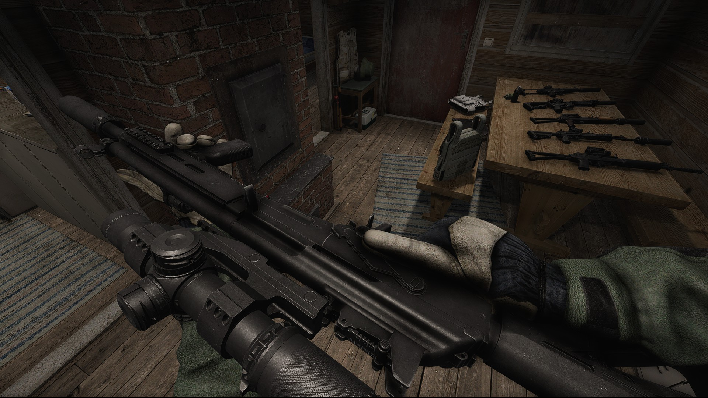 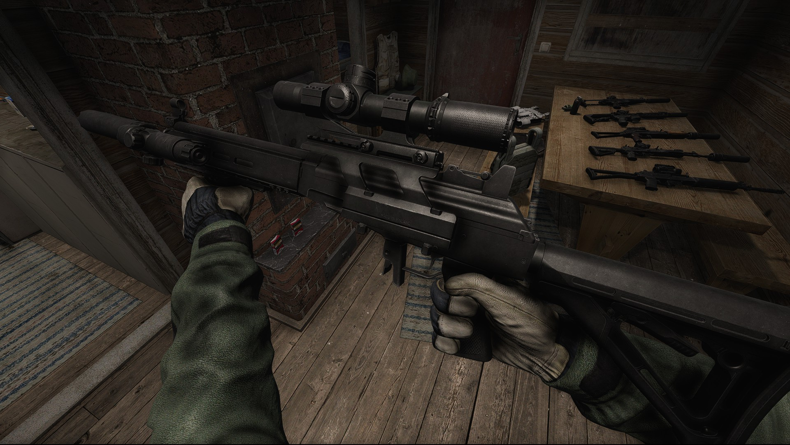

You can also flip the gun when inspecting it.

The guns in this game can be fitted with a plethora of attachments, I find that the best attachment combo is always an LPVO for long range shots, a laser module so you can just tilt the gun and take quick shots when engaging in close range using the laser as sights and, of course, a good suppressor.

Guns have a condition meter that can go from 100% to 0%, the closer it is to 0% the more likely it is to jam on you, so be mindful of that when taking a gun to the road, take good care of your firearm, and it'll take good care of you.

Also, it's not a weapon, but since you use your primary slot for it I'll consider it one, the good ole trusty fishing rod!

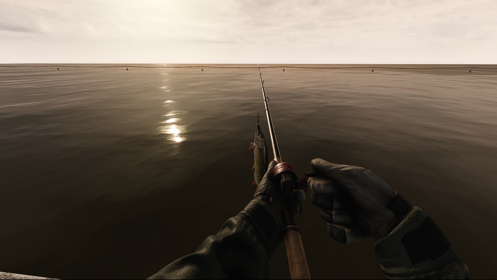

Would it be a real game if it didn't have fishing it it? I think not.

## In game events

There is a plethora of in game events that can happen in Road to Vostok that will change up how the game is played. And these events come to happen the longer you play the game. See, in this game, one day (24 hours) is the equivalent of 2.4 hours of real world time, you can also make the time go by faster by sleeping using a bed of a sleeping bag which will put you 6-12 hours ahead. The first events are the arrival of the two first NPCs, and from then on, it varies a lot. On the third day we get fighter jets passing through the area. On the fitfth we have a chance to meet the bandit boss, the Punisher, who is an infamous and feared debt collector in finland, I never found him so I don't know what the rage is all about. You can expect planes to deliver airdrops too.

And remember the minefield? The area we STRICTLY cannot RUN in? well, there is an event there too! Attack helicopters will now conduct aerial searches there in order to catch trespassers which completely turn the minefield dynamic upside down as if you get spotted by one, ALL of the guards are alerted, and the helos can fire rockets at you, the only way out it to make a run for it and hopefully, juuuuust hopefully, not be blown to smithereens by one of the mines.



These really make the game world feel more immersive and dynamic. Like it's evolving too, reacting to real changes.

And the events go on up until day 50 (Which I haven't reached just yet so we'll see)

## Conclusion

All in all, the game is pretty raw still, but I am MASSIVELY enthusiastic as to where the game will go next, by the way, this whole thing was made by one singular guy in Finland. And the trailer for the early access release, the 1.0.0 version this blog post is basing itself on, is honestly one of the best sales pitches I've ever seen a game developer do. Antti, the guy behind the game seems really excited about the game's future, really passionate about his project as he turned down steady retirement as a Finnish army officer to make this game and also aware of the "Early access survival game" phenomenon that seems to plague steam, overall very down to earth guy, the release trailer is him passionately talking about the project and I absolutely recommend you give it a watch.



The game's launch was also, thankfully, a resounding success, selling over 100k copies in the first 24 hours and raising a VERY stout budget for the years to come, which is absolutely insane for a solo developer or, any developer really, 100k copies is a LOT and I'm massively happy at how well this game did, Antti deserves it and we also deserve a game like this after being held hostage by a game everyone hates but seem to dominate this market anyway.

I think I yapped enough about it, there is a lot more to talk about this game but since this is my first blog post, I'll keep it like this, I don't want it to get way *too* lengthy, I'll come back to this title once it gets updated so you can definitely expect a part 2 but for now, that's everything I got for you, consider buying this and helping the development of Road to Vostok. This game is destined for greatness and I will keep you up to date on it's development as it unfolds, watching it with great interest.

Here's the link of the Steam page for the game, it's currently on sale so I really recommend picking it up now as the price will probably only go up from here as most Early Access titles do.

https://store.steampowered.com/app/1963610/Road_to_Vostok/

Thanks for reading.

<3